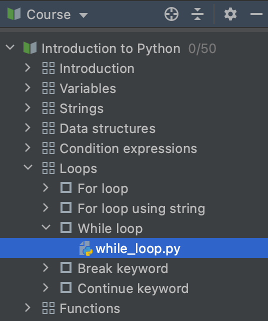

## 코스 보기

<b>코스 보기</b>는 코스 강의 계획서를 보여줍니다: 수업과 과제로 이루어진 목록입니다.

과제 이름을 더블 클릭하면 해당 과제로 이동할 수 있습니다.

코스 보기 창을 숨기려면 프로젝트 도구 창 버튼을 클릭하거나 &shortcut:ActivateProjectToolWindow;를 누르세요. 이렇게 하면 편집기와 과제 설명 창을 위한 공간이 더 넓어집니다.

숨겨진 코스 보기 창을 다시 표시하려면 프로젝트 도구 창 버튼을 한 번 더 클릭하거나 &shortcut:ActivateProjectToolWindow;를 다시 누르세요.