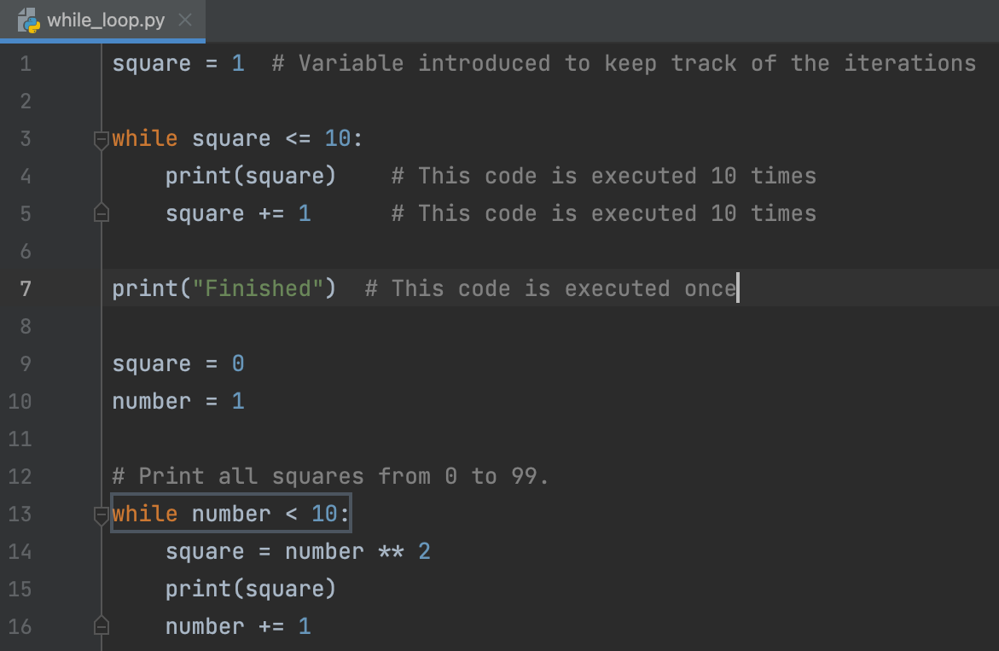
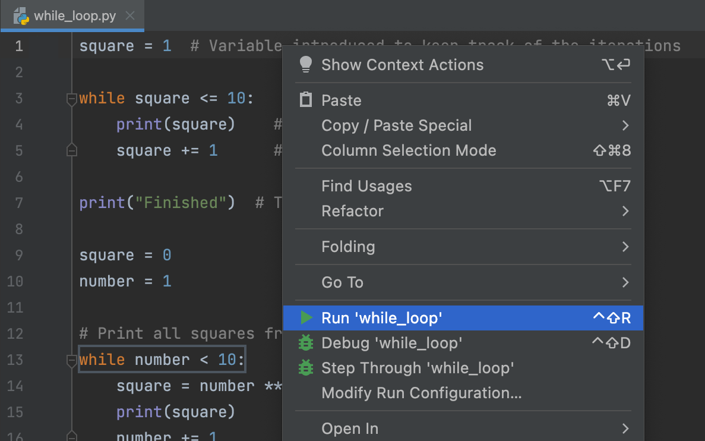

## 에디터

<b>에디터</b>는 여러분이 프로그래밍을 하게 될 작업 공간입니다. 이곳에서 이론적인 과제와 퀴즈를 진행하면서 자유롭게 실험해볼 수 있지만, 이곳에서의 작업은 검토되지 않습니다.

프로그래밍 과제에서는 에디터에서 기존 코드를 수정하거나 처음부터 직접 코드를 작성하게 됩니다. 이 코드는 검토됩니다.

코드를 실행하고 싶을 때는 언제든지 컨텍스트 메뉴에서 실행 옵션을 선택하거나 &shortcut:Run; 키를 누르세요:

에디터로 돌아가 코드를 작성하는 데 집중하고 싶다면, 가장 빠른 방법은 모든 창 숨기기 명령 (&shortcut:HideAllWindows;)을 사용하는 것입니다. 모든 창을 다시 표시하려면 명령을 다시 실행하면 됩니다.