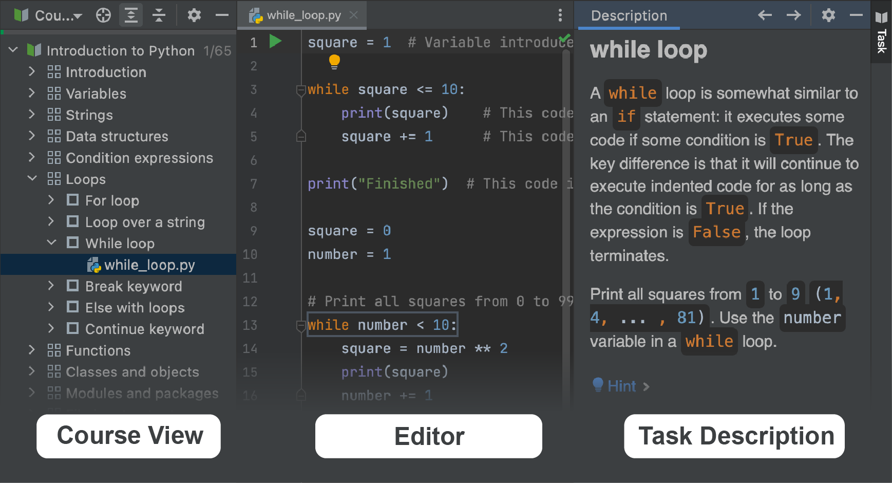

## JetBrains Academy 플러그인 개요

이 강의에서는 [JetBrains Academy 플러그인](https://www.jetbrains.com/help/education/educational-products.html)을 사용하여 Python을 배우기 위한 첫 단계를 도와드립니다.

JetBrains Academy 플러그인을 사용하면 코딩 과제를 완료하고 IDE 내부에서 즉각적인 피드백을 받으면서 프로그래밍 언어와 도구를 배울 수 있습니다.

이제 설명은 그만하고 시작해봅시다!

만약 이미 인터페이스에 익숙하다면 이 강의를 건너뛸 수 있습니다.

### 코스 작업하기
JetBrains Academy 플러그인에서 제공되는 모든 코스는 강의 목록으로 구성되어 있습니다. 강의는 다시 여러 섹션으로 그룹화될 수 있습니다. 각 강의는 여러 개의 과제를 포함하고 있습니다.

코스를 열면 탐색에 사용되는 주요 도구 창을 볼 수 있습니다: <b>코스 보기</b>, <b>편집기</b>, 그리고 <b>과제 설명</b>:

다음 과제로 이동하려면 "다음" 버튼을 클릭하세요.