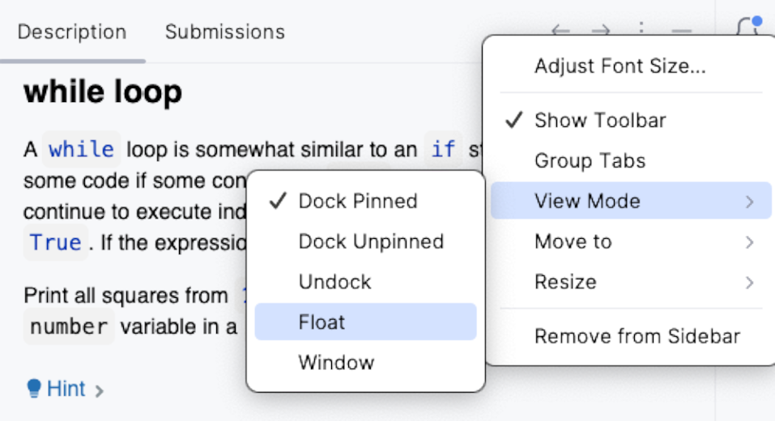

## 작업 설명

**작업 설명** 창에서는 작업을 완료하는 데 필요한 모든 정보를 제공합니다:

이론적인 작업의 경우, 설명에는 학습 및 읽기 자료가 포함됩니다.  
퀴즈의 경우, 다중 선택 질문이 제공됩니다.  
프로그래밍 과제의 경우, 해결해야 할 문제가 명시됩니다.

다음 작업을 수행하려면 작업 설명 아이콘을 사용하십시오:

| 아이콘                              | 설명                          |
|------------------------------------|-------------------------------|
| **Check**                          | 답안(퀴즈) 또는 코드 솔루션(프로그래밍 과제)의 정확성을 확인합니다|   
| **Run**                            | 코드를 실행합니다 (이론 과제의 경우)|
|                | 이전 작업으로 이동합니다|    
| &nbsp;또는 **Next** | 다음 작업으로 이동합니다| 
|               | 작업에서 수행한 모든 변경 사항을 취소하고 처음부터 다시 시작합니다| 
|         | Stepik에서 작업 페이지를 보고 댓글을 남깁니다| 
|<a>Peek Solution...</a>             | 정답을 공개하고 <b>변경 사항(diff)</b>을 보여줍니다|

**작업 설명** 창을 항상 표시된 상태로 유지하고 숨기지 않는 것을 권장합니다. 만약 너무 산만하다면, 오른쪽 상단에 있는  버튼을 클릭하여 숨길 수 있습니다.

두 개의 모니터를 사용하는 경우, 작업 설명 패널을 떠다니는 모드로 전환하고 두 번째 모니터로 이동하거나 IDE 메인 창 근처에 배치하는 것이 유용할 수 있습니다. 이를 위해 도구 창 설정  /  아이콘을 클릭하십시오:

