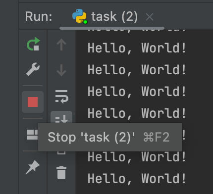

## 무한 실행 수정

코드 편집기에는 `while` 루프가 [함수](course://Functions/Definition) 안에 정의되어 있습니다. 지금은 이에 대해 걱정할 필요가 없으며, 함수에 대해서는 다음 섹션에서 배울 것입니다. 현재 작성된 방식대로라면, 이 함수 내부의 while 루프는 조건이 항상 `True`이기 때문에 무한히 실행됩니다. 코드를 실행하여 직접 확인할 수 있습니다. 실행을 종료하려면 Run 창 왼쪽에 있는 빨간색 정지 버튼을 사용하세요.

### 과제
루프가 `"Hello, World!"`를 5번 출력한 후 종료되도록 코드를 수정하세요.

 

각 반복에서 `i`의 값을 업데이트하세요.

